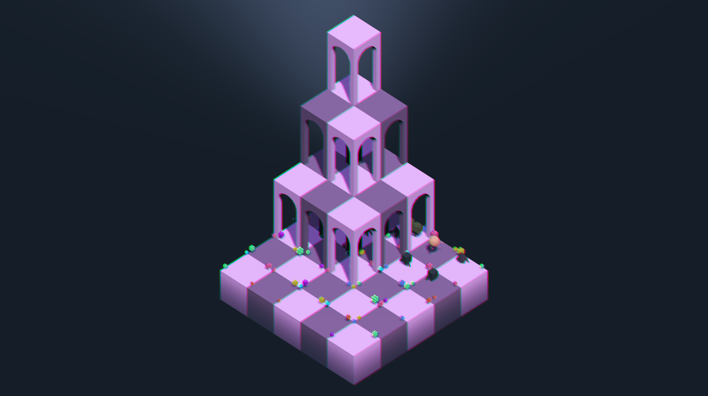

# Hey, I'm Hugo!

**Programmer · C · C++ · C# | Game Developer · Unity · Godot · Playdate | Video Essayist | Architect**

  
   
  <em>Me (dramatization)</em>
   
   

Welcome to my corner of GitHub! I'm a multidisciplinary game-focused developer with a unique blend of technical programming skills, design background and creative storytelling. Currently diving deep into the world of gameplay programming at 42 Barcelona while building games and exploring the intersection of technology, narrative design, and human experience.

## About Me

- **Low-Level Programming**: Proficient in C/C++, systems programming, and graphics APIs (OpenGL, exploring Vulkan)
- **Game Development**: Unity, Godot Engine, Playdate SDK, game mechanics design, physics implementation
- **Object-Oriented Programming**: Strong foundation in OOP principles, design patterns, and software architecture
- **Web Development**: Full-stack development with JavaScript/TypeScript, Node.js, WebSocket, PixiJS
- **Creative & Design**: 10+ years in game criticism, video production, architectural design, and interactive exhibitions
- **Languages**: Spanish (native), English (CPE certified), Japanese (JLPT N4), Italian (B2), Catalan

## Currently Working On

- **Sombra**: A shadow puppet game prototype for Playdate
- **Zappy**: Turn-based strategy game developed in Godot Engine
- **Rosario**: A C++ Raylib based game engine built from scratch
- **ft_vox**: Experimenting with Vulkan API to deepen understanding of modern rendering pipelines

  

 

  

 

  
  

## Next Steps

- Expanding Godot Engine and C# expertise through ongoing game projects
- Diving into Vulkan graphics programming for advanced rendering techniques
- Learning Lua and experimenting with the Playdate SDK for retro game development
- Compiling a new book of video essay scripts on game narratives and culture
- Preparing for JLPT N3 to advance my Japanese proficiency

## Featured Projects

**[Nibbler](https://github.com/hugomgris/nibbler)**
Cross-platform Snake game reimagining with hot-swappable graphics libraries and zero-leak memory management. Exploring the boundaries between ASCII art, pixel graphics, and isometric 3D — all in a single executable.

**[Sprite Ditherer](https://github.com/hugomgris/sprite_ditherer)**  
Python based, Blender script pipeline to snapshot and dither riggeed models

**[PONG - The Echo From a Distant Past](https://github.com/hugomgris/pong)**  
Modern, extensible Pong game engine with PixiJS/TypeScript, featuring advanced physics, real-time multiplayer, AI opponents, and ECS architecture

**[ft_transcendence](https://github.com/hugomgris/ft_transcendence)**  
Full-stack Pong with blockchain integration, 2FA security, and microservices architecture

**[SCOP](https://github.com/hugomgris/scop)**  
3D object viewer in C++/OpenGL with modular rendering, multiple display modes, multi-texture/shader support, and custom UI

**[FDF++](https://github.com/hugomgris/FDFPP)**  
Map-based wireframe renderer in C++ with MLX42, emphasizing efficient 3D projection and real-time VFX

**[Hackout](https://github.com/hugomgris/Hackout)**  
Terminal-based password cracking game inspired by Fallout's hacking minigame, built in C

## Tech Stack

### Programming Languages

### Game Development & Graphics

### Web & Tools

## Let's Connect!

- **Links**: [Linktree](https://linktr.ee/hugomgris)
- **LinkedIn**: [Hugo Muñoz Gris](https://www.linkedin.com/in/hugo-mu%C3%B1oz-gris/?locale=en_US)
- **Email**: hugomgris@gmail.com
- **42 Profile**: [hmunoz-g](https://profile.intra.42.fr/users/hmunoz-g)
- **YouTube**: [Hugo M. Gris](https://www.youtube.com/c/HugoMGris)
- **Itch.io**: [hugomgris](https://hugomgris.itch.io/)
- **Bluesky**: [@hugomgris](https://bsky.app/profile/hugomgris.bsky.social)
- **Instagram**: [@itsallmilk](https://www.instagram.com/itsallmilk/)
- **Patreon**: [Support my work](https://www.patreon.com/c/hugomgris)

